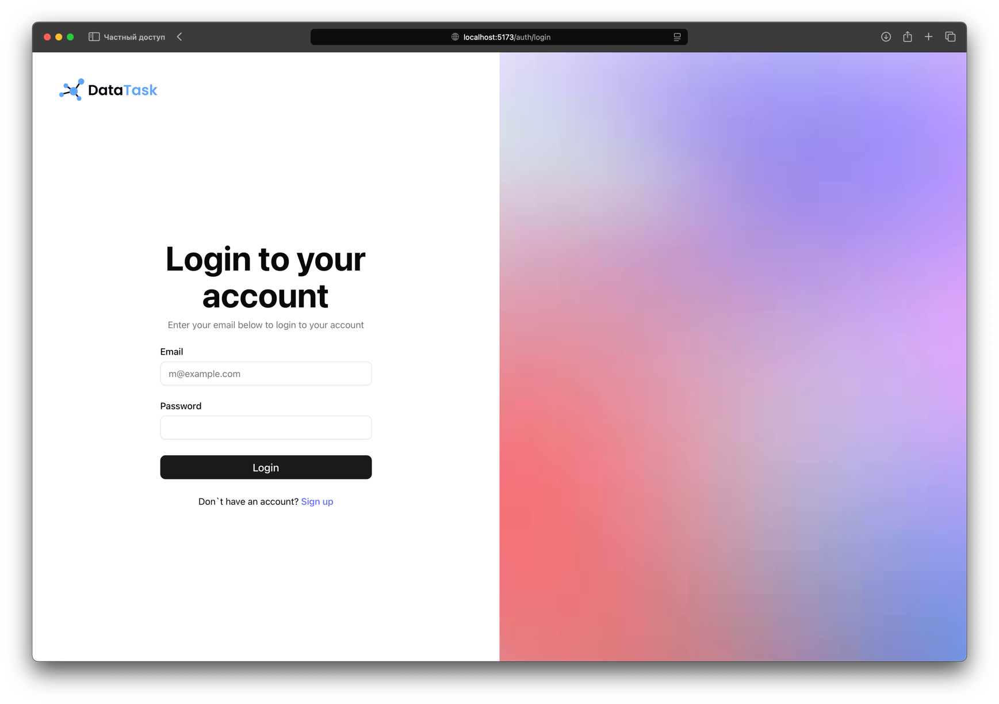
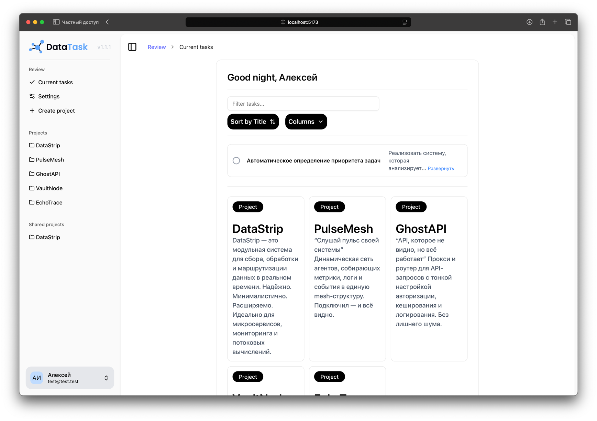
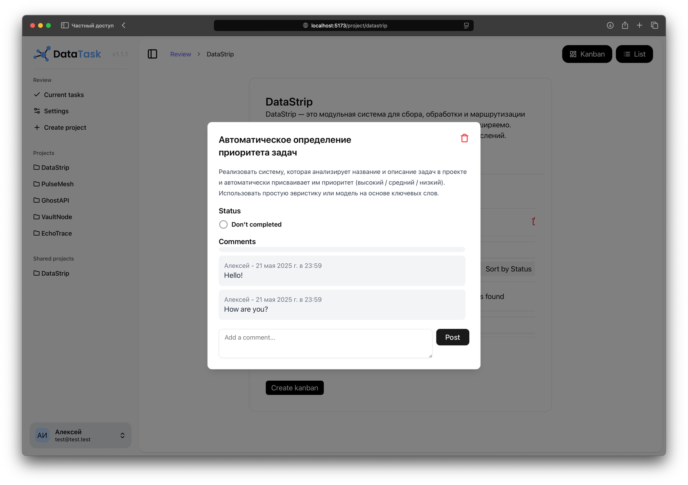
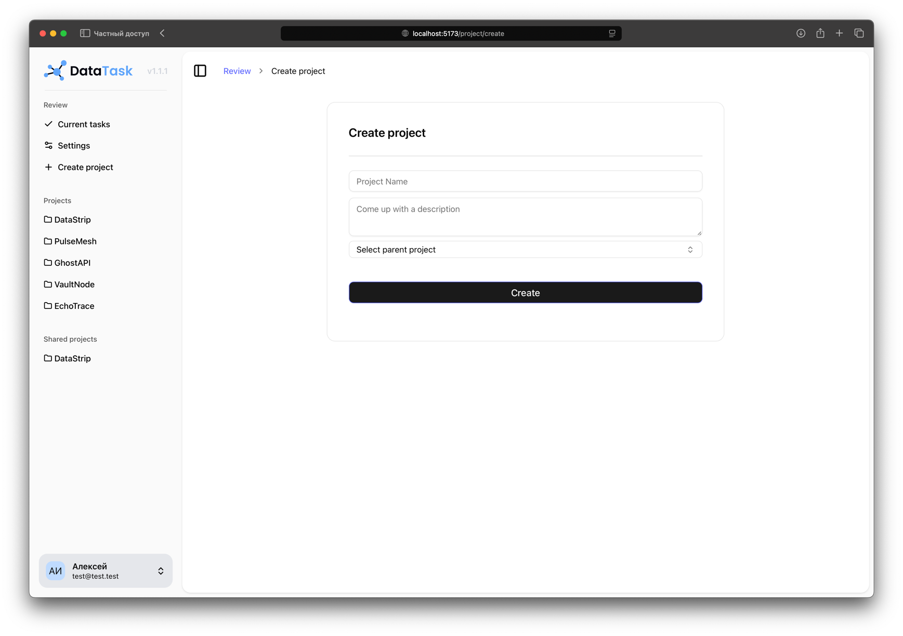

# DataTask: Frontend – Your Interactive Task Planner

## 🚀 Introduction

**DataTask Frontend** is an intuitive and functional user interface for your task tracker. Designed with a focus on usability and performance, this repository contains all the code needed to run an interactive web application that allows users to efficiently manage their tasks, projects, and deadlines.

Our frontend provides seamless interaction with the **DataTask Backend** (link to your backend repository) for retrieving and sending data, creating a comprehensive task management solution.

---

## ✨ Key Frontend Features

- **Intuitive and Responsive Design:** Built for ease of use on any device, from desktops to mobile phones.
- **Dynamic Task Management:** Instantly add, edit, delete, and update task statuses.
- **Flexible Organization:** Supports categories, priorities, and deadlines for detailed task organization.
- **Powerful Search and Filtering:** Easily find tasks based on various criteria.
- **User Notifications:** Integrated notification system (optional, if available).
- **Modern Technology Stack:** Built on cutting-edge web technologies for stability and performance.

---

## 🖥️ Screenshots









---

## 🛠️ Installation and Setup

To run DataTask Frontend locally, follow these steps:

### Running via Docker

```bash
docker compose up --build
```

### Prerequisites

Ensure you have Node.js (LTS version recommended) and npm (usually included with Node.js) or Yarn installed.

### Cloning the Repository

```bash
git clone https://github.com/yourusername/datatask-frontend.git
cd datatask-frontend
```

### Installing Dependencies

npm:

```bash
npm install
```

yarn:

```bash
yarn install
```

### Setting Up Environment Variables

Create a `.env.development` file in the project’s root directory and add the following variables:

```text
VITE_API_URL=http://localhost:8080  # backend application address
VITE_BOT_URL=https://t.me/bot
```

**Important:** Ensure your DataTask Backend is running and accessible at the specified address.

### Running the Application

npm:

```bash
npm start
```

yarn:

```bash
yarn start
```

## 🧪 Testing

*(If tests are available, describe how to run them)*

To run tests, use the following command:

```bash
npm test
```

## 🤝 Contributing

I welcome contributions to the development of DataTask Frontend!

If you have suggestions, bug reports, or want to add new features, please:

1. Fork the repository.
2. Create a new branch (`git checkout -b feature/AmazingFeature`).
3. Make your changes and commit them (`git commit -m 'Add some AmazingFeature'`).
4. Push to your branch (`git push origin feature/AmazingFeature`).
5. Open a Pull Request.

Please ensure your code adheres to the accepted standards and passes all tests.

## 📄 License

This project is licensed under the MIT License. See the LICENSE file for details.